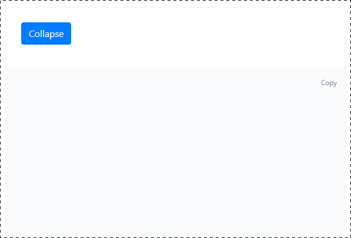
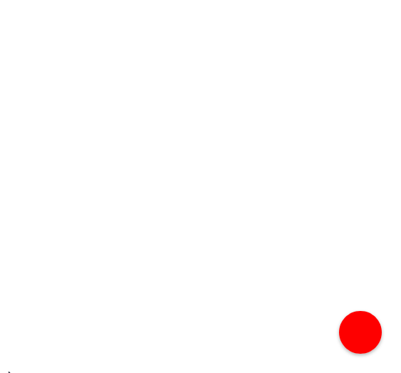
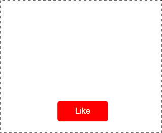

Правила сдачи задания:

1. **Важно**: в рамках этого ДЗ можно использовать любой менеджер пакетов.
1. Вы можете сделать все три задачи в одном репозитории и показать работу всех трёх виджетов на одной странице. Главное, чтобы все виджеты были оформлены в виде отдельных классов.
1. Всё, включая картинки и стили, должно собираться через Webpack и выкладываться на Github Pages через Appveyor.
1. В README.md должен быть размещён бейджик сборки и ссылка на Github Pages.
1. В качестве результата пришлите проверяющему ссылки на ваши GitHub-проекты.
1. Авто-тесты писать не требуется.

---

### Collapse

#### Легенда

В рамках реализации большого портала вам необходимо сделать виджет collapsible-контейнеров, который может разворачиваться и сворачиваться.

#### Описание

Подобный виджет есть в рамках Bootstrap, но мы с вами знаем, что jQuery не нужен, поэтому реализуйте такой же виджет на чистом JS.

Авто-тесты для этой задачи не нужны.

---

### Callback Chat

#### Легенда

Сделайте виджет обратной связи на портал компании. Ключевое в этой задаче — анимации.

#### Описание

Реализуйте показ и скрытие, как это отображено на картинке:

Обратите внимание, что при нажатии на кнопку сама кнопка тоже исчезает, а при скрытии формы появляется.

Длительность анимации, использованная в оригинале, — 100ms, функция анимации — `linear`.

Организуйте код в виде виджета, готового к установке через базовый контейнер в html и инициализацию.

Авто-тесты для этой задачи не нужны.

---

### Liker

#### Легенда

Реализуйте одну из кнопок лайков.

#### Описание

Реализуйте поведение, указанное на картинке:

Данные для анимации:
1. Изображение — .
1. Высота, на которой исчезают лайки, — 200px.
1. Максимальное отклонение влево/вправо — 50px.
1. Скорость анимации — 500ms.
1. Функция анимации — ease-out, можете использовать другую.
1. Возможные траектории (траектория выбирается рандомно):
    1. 0 % — центр, 25 % — влево, 50 % — центр, 75 % — вправо, 100 % — центр.
    1. 0 % — центр, 25 % — центр, 50 % — вправо, 75 % — влево, 100 % — центр.
    1. 0 % — центр, 25 % — центр, 50 % — влево, 75 % — вправо, 100 % — центр.
    1. 0 % — центр, 25 % — вправо, 50 % — центр, 75 % — влево, 100 % — центр.

**Важно**: элементы после исчезания должны удаляться из DOM. Используйте для этого соответствующие события, а не таймауты.
