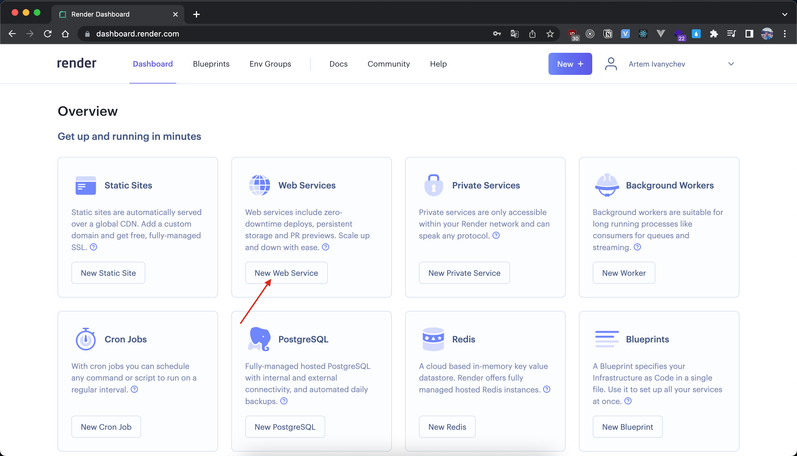
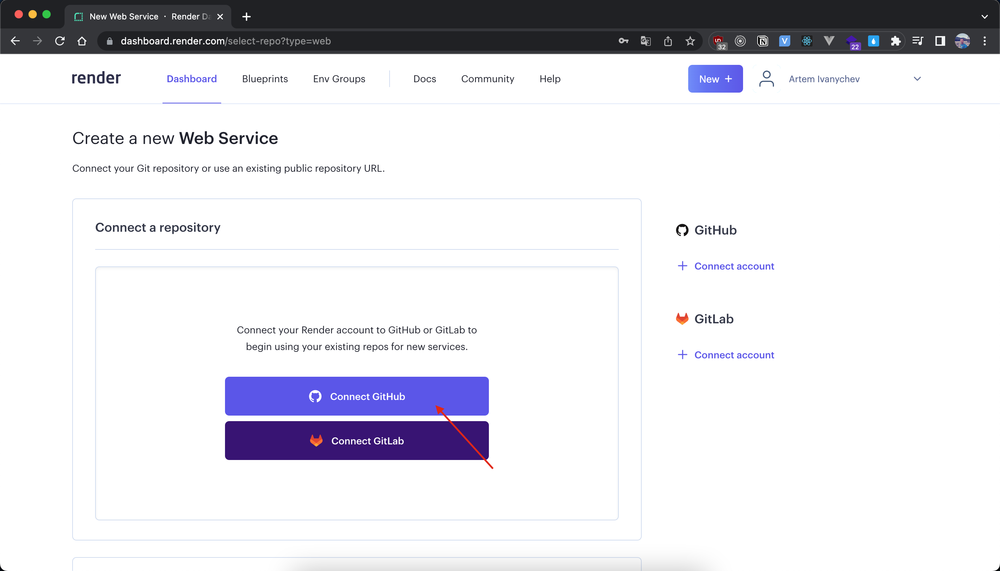
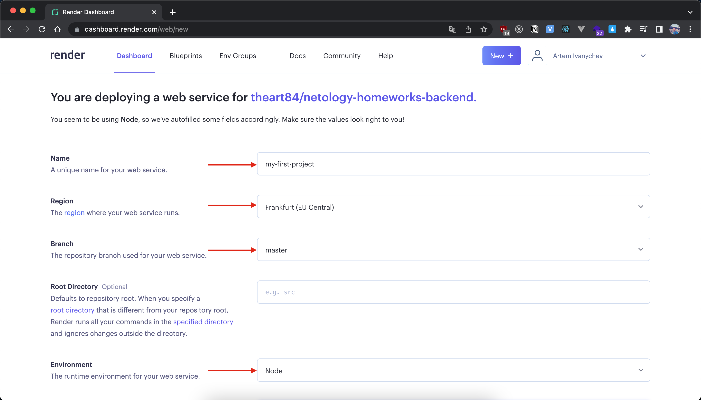
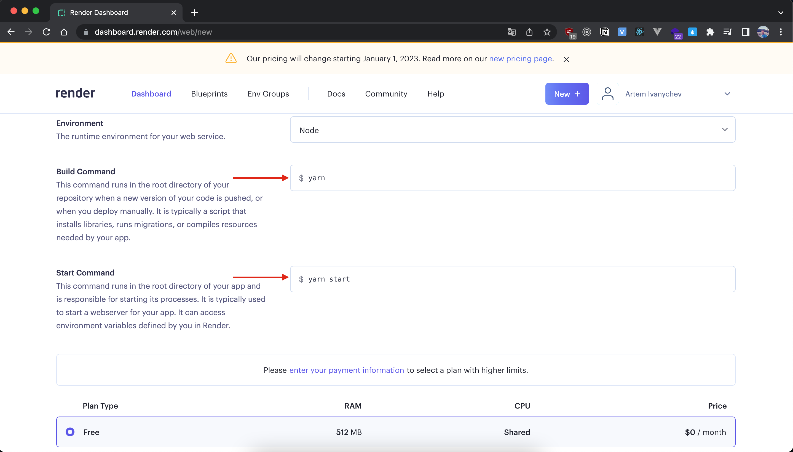
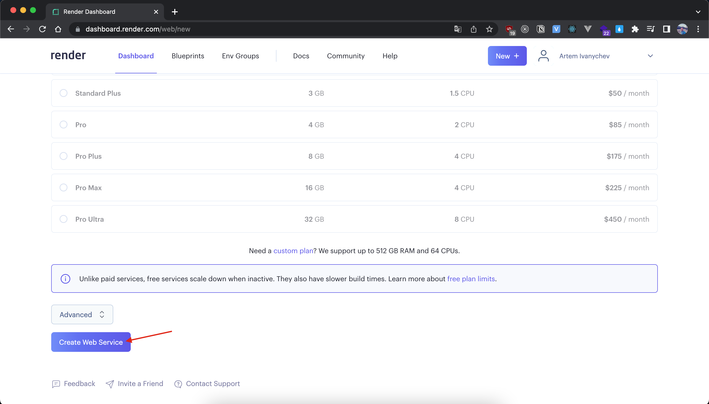
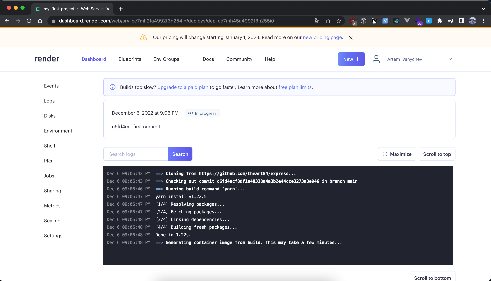
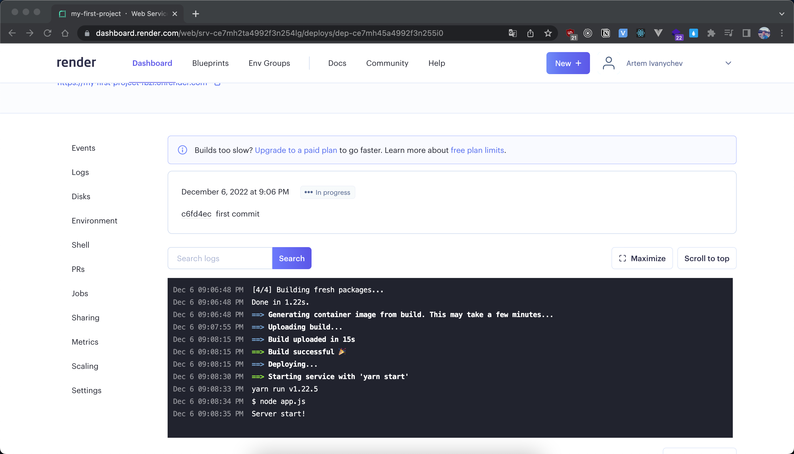
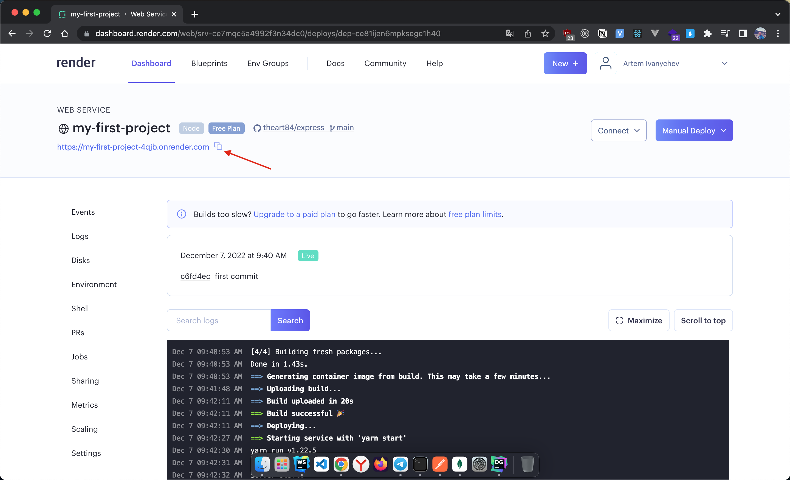
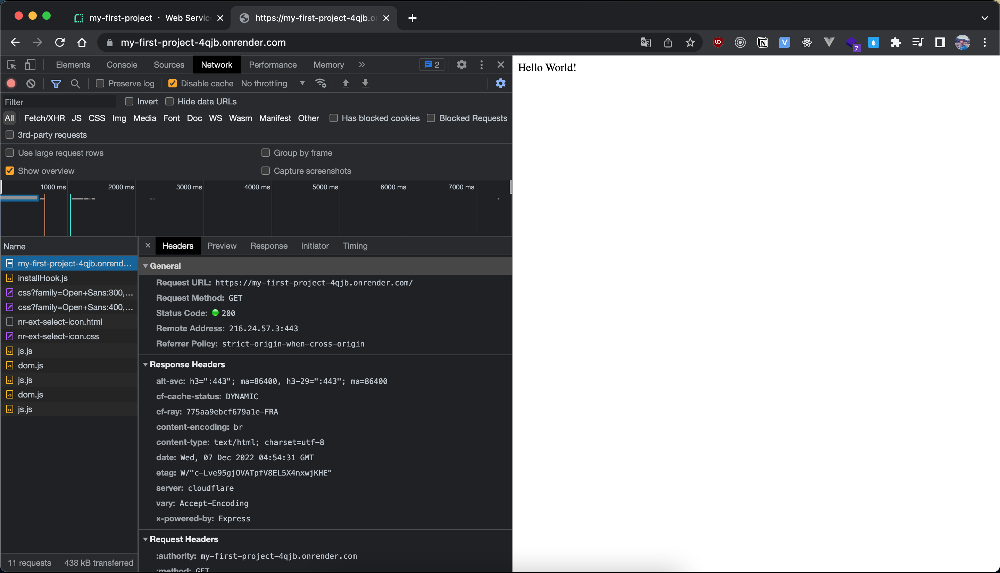

**Инструкция по настройке render для автоматического деплоя приложения**

1. Регистрируемся на render.com
2. После регистрации и активации учетной записи, мы попадаем в дашборд.
3. Выбираем "Web Service"

4. Далее необходимо подключить свой аккаунт на гитхаб, для этого кликаем "Connect Github"

5. Нас перенаправляет на сайт Github, где нужно подтвердить свои действия и разрешить render доступ к вашему репозиторию.  
Можно выбрать все репозитории или какой-то определенный. 
6. После поключения своего аккаунта к render, возвращаемся обратно в дашборд render и выбираем тот репозиторий, который необходим.
7. Следующий шаг - настройка деплоя

  а) имя проекта;
  б) выбираем регион (я выбрал Германию, она ближе к нам, значит, будут минимальные задержки, для себя можете выбрать что-то другое); 
  в) выбираем ветку, с которой будет собираться приложение;
  г) указываем среду, в которой будет исполняться приложение (нам нужна Node);

  д) указываем команду для установки зависимостей и билда;
  е) последний шаг в настройке - указать команды для старта приложения;

  ж) нажимаем "Create Web Service".
8. Приложение начнет собираться. Выглядит это так:

9. Завершающий этап сборки и старт приложения

10. Проверяем работоспособность приложения. Для этого кликаем по ссылке 
и, если все хорошо и приложение удачно собралось и развернулось на сервере, 
то, обратившись по вашим end points, вы будете получать ответы от сервера

11. Приложение отдает по корневому роуту ответ "Hello World"

На этом настройка завершена. Ура :)

