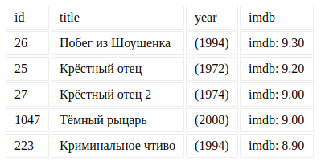
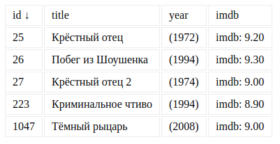

# Домашнее задание к занятию "2. DOM"

Правила сдачи задания:

1. **Важно**: в рамках этого ДЗ можно использовать любой менеджер пакетов
1. **Важно**: всё должно собираться через Webpack (включая картинки и стили) и выкладываться на Github Pages через Appveyor.
1. В README.md должен быть размещён бейджик сборки и ссылка на Github Pages
1. В качестве результата присылайте проверяющему ссылки на ваши GitHub-проекты

---

### Перемещение элемента

#### Легенда

Вы решили развлечься и реализовать некое подобие игры, где гномы (или другие существа), выскакивают из "отверстий" и по ним нужно бить молотком:


Copyright gfycat.com

#### Описание

Соберите инфраструктуру проекта на базе Webpack, ESLint, Babel, Jest, Webpack Dev Server.

Поскольку мы более гуманны, вам нужно реализовать лишь первую часть этой игры - перемещение объекта в DOM Tree.

Для этого самостоятельно разработайте игровое поле 4x4 и персонажа в виде картинки `img` (при загрузке страницы должен программно генерироваться и ставиться в рандомную позицию внутри игрового поля). С помощью функции `setInterval` запланируйте перемещение существующего объекта `img` в другое поле (алгоритм - рандомное перемещение, без перемещения в то же самое поле).

Для картинки персонажа используйте следующую:


Важно: не используйте `removeChild`! Проверьте, что будет, если `Node` изменить родителя.

Всё должно собираться через Webpack (включая картинки и стили) и выкладываться на Github Pages через CI.

**В качестве результата пришлите проверяющему ссылку на ваш GitHub-проект. Не забудьте установить бейджик сборки.**

---

### Loading and Sorting, data-attributes (задача со звёздочкой)

Важно: эта задача не является обязательной. Её (не)выполнение не влияет на получение зачёта по ДЗ.

#### Легенда

Вам с сервера приходят данные с фиксированным набором полей (см. описание ниже). Вам необходимо сгенерировать по этим данным html-таблицу и вставить её в DOM Tree. Поскольку мы ещё не проходили события, воспользуйтесь функцией `setInterval` для того, чтобы каждые 2 секунды менять порядок сортировки:
* по возрастанию - по первому полю (остальные поля не учитываются)
* по убыванию - по первому полю (остальные поля не учитываются)
* по возрастанию - по второму полю (остальные поля не учитываются)
* по убыванию - по второму полю (остальные поля не учитываются)
* по возрастанию - по третьему полю (остальные поля не учитываются)
* по убыванию - по третьему полю (остальные поля не учитываются)
* то же самое по четвёртому полю
* всё повторяется с первого пункта

#### Описание

Формат приходящих данных (JSON):
```json
[
  {
    "id": 26,
    "title": "Побег из Шоушенка",
    "imdb": 9.30,
    "year": 1994
  },
  {
    "id": 25,
    "title": "Крёстный отец",
    "imdb": 9.20,
    "year": 1972
  },
  {
    "id": 27,
    "title": "Крёстный отец 2",
    "imdb": 9.00,
    "year": 1974
  },
  {
    "id": 1047,
    "title": "Тёмный рыцарь",
    "imdb": 9.00,
    "year": 2008
  },
  {
    "id": 223,
    "title": "Криминальное чтиво",
    "imdb": 8.90,
    "year": 1994
  }
]
```

Все параметры конкретного фильма вы решили хранить в DOM в виде `data-*` атрибутов, т.е. для каждого фильма должно быть (примерный вид):

```html
<tr data-id="25" data-title="Побег из Шоушенка" data-year="1994" data-imdb="9.30">
  <td>#25</td>
  <td>Побег из Шоушенка</td>
  <td>(1994)</td>
  <td>imdb: 9.30</td>
</tr>
```

При сортировке используйте только значения, хранящиеся в DOM (в `data-*`). Для этого выберите все `tr`-элементы и сортируйте их в отдельном массиве. Это нужно для того, чтобы вы:
1. Усвоили неудобство этого подхода
1. Поняли особенности работы с атрибутами

Естественно, id, оценки и года выпуска должны сортироваться как числа, а названия - как строки.

Внешний вид без сортировки (вы можете визуально улучшить отображение):



Обратите внимание, в каком виде выводятся оценки (после точки всегда два символа).

При сортировке по id (по возрастанию):



Обратите внимание на стрелку возле id.


Всё должно собираться через Webpack (включая картинки и стили) и выкладываться на Github Pages через CI.

**В качестве результата пришлите проверяющему ссылку на ваш GitHub-проект. Не забудьте установить бейджик сборки.**

**Advanced**: попробуйте реализовать diff между положением элементов в DOM-дереве и в отсортированном вами массиве, если положение отличается, то должна быть произведено перемещение элемента в DOM-дереве (а не пересобирайте всё DOM-дерево). Advanced-часть не является обязательной.

---

### In-Memory Sorting (задача со звёздочкой)

Важно: эта задача не является обязательной. Её (не)выполнение не влияет на получение зачёта по ДЗ.

#### Легенда

Достаточно намучившись с `data-*` вы поняли, что хранить всю информацию в DOM и в атрибутах в частности, не всегда самая лучшая идея и решили реализовать хранение в памяти.

#### Описание

Формат приходящих данных (JSON):
```json
[
  {
    "id": 26,
    "title": "Побег из Шоушенка",
    "imdb": 9.30,
    "year": 1994
  },
  {
    "id": 25,
    "title": "Крёстный отец",
    "imdb": 9.20,
    "year": 1972
  },
  {
    "id": 27,
    "title": "Крёстный отец 2",
    "imdb": 9.00,
    "year": 1974
  },
  {
    "id": 1047,
    "title": "Тёмный рыцарь",
    "imdb": 9.00,
    "year": 2008
  },
  {
    "id": 223,
    "title": "Криминальное чтиво",
    "imdb": 8.90,
    "year": 1994
  }
]
```

Храните все полученные объекты в памяти в виде массива и сортировку осуществляйте на базе этого массива (мутировать массив или нет - решать вам). После каждой сортировки пересобирайте заново дерево DOM.

Формат генерируемого DOM должен быть такой же, как в предыдущей задаче.

Внешний вид без сортировки (вы можете визуально улучшить отображение):


Обратите внимание, в каком виде выводятся оценки (после точки всегда два символа).

При сортировке по id (по возрастанию):


Обратите внимание на стрелку возле id.


Всё должно собираться через Webpack (включая картинки и стили) и выкладываться на Github Pages через CI.

**В качестве результата пришлите проверяющему ссылку на ваш GitHub-проект. Не забудьте установить бейджик сборки.**
