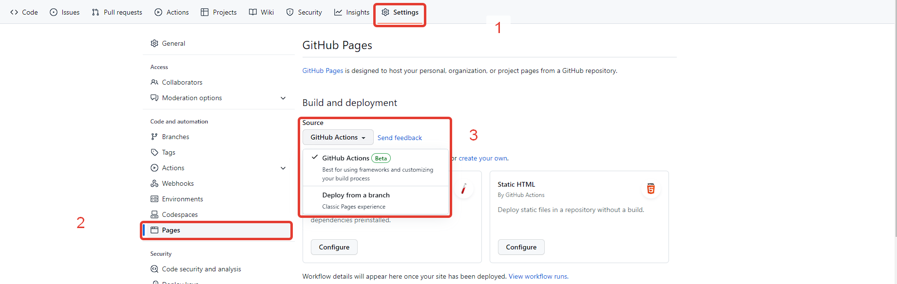

# Домашнее задание к занятию "1. Рабочее окружение"

**Важно**: все задачи к данной лекции можно выполнить в виде одного репозитория (т.е. допускается не делать отдельные репозитории на каждую задачу).

### Continuous Deployment

#### Описание

Воспользуйтесь пошаговой инструкцией ниже, чтобы развернуть тестирование, сборку и deployment на GitHub Actions и GitHub Pages.

В качестве шаблона для развёртывания используйте [проект](https://github.com/netology-code/ahj-code/tree/master/env).

Не забудьте поставить бейджик со статусом в `README.md`.

**В качестве результата пришлите проверяющему ссылку на ваш GitHub-проект.**

### Инструкция:
1. Скачать репозиторий https://github.com/netology-code/ahj-code/tree/master/env
2. Создать новый репозиторий на github
3. Скопировать в новый репозиторий папку `env`
4. Настроить новый репозиторий. Указать в нём использование GitHub Action для публикации приложения, вместо публикации из ветки (gh-pages)
   
5. В файле `REAME.md` в строке:
```md

```
Заменить `<OWNER>` на ваш ник на github;

Заменить `<REPOSITORY>` на название вашего репозитория;
