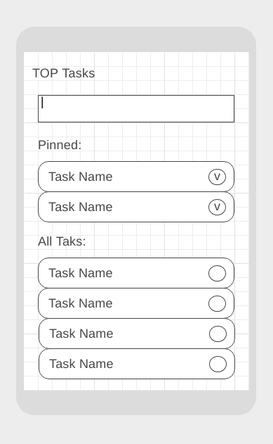
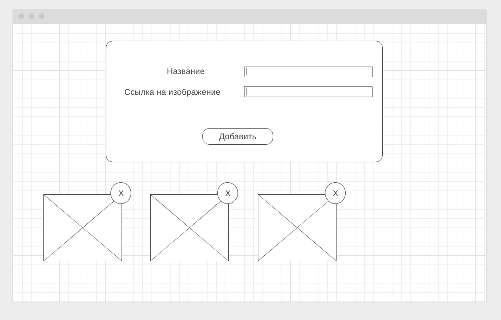

Правила сдачи задания:

1. **Важно**: в рамках этого ДЗ нужно использовать менеджер пакетов yarn (а значит, никакого `package-lock.json` в репозитории быть не должно)
1. **Важно**: всё должно собираться через Webpack (включая картинки и стили) и выкладываться на Github Pages через Appveyor.
1. В README.md должен быть размещён бейджик сборки и ссылка на Github Pages
1. В качестве результата присылайте проверяющему ссылки на ваши GitHub-проекты

---

### Игра с гоблинами

#### Легенда

Вы решили доделать игру с гоблинами, поэтому нужно реализовать оставшуюся логику.

#### Описание

Нужно доделать игру с гоблинами, реализовав следующую логику:
1. Гоблин появляется в рандомной точке (набор точек фиксирован) ровно на 1 секунду
1. Если пользователь успел за это время кликнуть на этой точке (попробуйте сделать custom-курсор в виде молотка), то:
    * пользователю засчитывается +1 балл
    * гоблин пропадает из ячейки
1. Если пользователь пропустил 5 появлений гоблинов, то игра завершается.

Попробуйте реализовать всё не в виде единого скрипта, а разбив приложение на классы, каждый из которых ответственен за опредённую логику.

Всё должно собираться через Webpack (включая картинки и стили) и выкладываться на Github Pages через CI.

**В качестве результата пришлите проверяющему ссылку на ваш GitHub-проект. Не забудьте установить бейджик сборки.**

---

### TOP Tasks* (задача со звёздочкой)

Важно: эта задача не является обязательной. Её (не)выполнение не влияет на получение зачёта по ДЗ.

#### Легенда

Вы разрабатываете трекер задач, в котором есть возможность отображать назначенные пользователю задачи. Выглядеть это должно примерно так, как на экране:

Пользователь может фильтровать и добавлять (вот так вот решили проектировщики и заказчик приложения) задачи с помощью поля ввода. Некоторые задачи можно закреплять ("pin").

#### Описание

1. Добавлять задачи можно при следующих условиях: в поле ввода есть текст и пользователь нажал "Enter" (если текста нет, но пользователь всё равно нажал "Enter" должно выводиться сообщение об ошибке - предложите, как это сделать (ни в коем случае не alert и не console.*))
1. При добавлении задачи задача добавляется в блок "All Tasks", а поле ввода очищается
1. Когда закреплённых задач нет, в блоке "Pinned" должен отображаться текст "No pinned tasks"
1. Когда закреплённые задачи есть, они отображаются в блоке "Pinned" и не участвуют в процедуре фильтрации:
    * их отображение никак не зависит от состояния фильтра
    * они не отображаются в блоке "All Tasks"
1. При пустом поле ввода в блоке "All Tasks" отображаются все задачи с учётом условий предыдущего пункта (т.е. все, кроме "Pinned")
1. При изменении поля ввода содержимое блока "All Tasks" автоматически пересчитывается - отображаются только те задачи, название которых начинается с того, что введено в поле ввода (без учёта регистра)
1. Если значению поля ввода не удовлетворяет ни одна из задач, то в блоке "All Tasks" отображается текст "No tasks found"
1. При выставлении переключателя (круглая иконка справа) задача из блока "All Tasks" попадает в "Pinned"
1. При снятии переключателя (круглая иконка справа) задача из блока "Pinned" попадает в блок "All Tasks" (при этом учитывайте состояние фильтра)

Все задачи должны храниться в едином массиве в памяти JS. Каждая задача должна из себя представлять объект класса "Task" (который вы разработаете сами). Перестройка DOM-дерева должна происходить на основании объектов, хранящихся в памяти.

Всё должно собираться через Webpack (включая картинки и стили) и выкладываться на Github Pages через CI.

**В качестве результата пришлите проверяющему ссылку на ваш GitHub-проект. Не забудьте установить бейджик сборки.**

---

### Галерея изображений с проверкой URL (задача со звёздочкой)

Важно: эта задача не является обязательной. Её (не)выполнение не влияет на получение зачёта по ДЗ.

#### Легенда

Вам необходимо реализовать легковесный "менеджер изображений" - на самом деле это будет приложение, которое разрешает пользователю вводить "Название изображения" и "URL" к нему.

Важная достаточно вещь, Заказчик хочет, чтобы если ссылка неверная - т.е. по этой ссылке нет валидного изображения, то добавления объекта не происходило. Подумайте как это сделать. Подсказка: у вас есть механизм событий и вполне возможно, что для элемента img есть события, которые вам в этом помогут.

Важно: вам не нужно валидировать посимвольно сам URL, смотреть есть ли расширение в конце и т.д.!

#### Описание

Приложение должно выглядеть следующим образом:

Функциональность:
1. Добавлять можно как по кнопке "Добавить" так и по клавише Enter (подумайте, как это реализовать)
1. Если URL картинки валидный (т.е. там есть картинка) должно происходить создание блока (см. три блока внизу) для добавленной картинки. Соответственно, в блоке - картинка и элемент для удаления картинки
1. Если URL картинки не валидный, добавления происходить не должно, вместо этого под полем "Ссылка на изображение" должна появляться надпись "Неверный URL изображения"
1. После добавления поля должны очищаться

Старайтесь разделить своё приложение на классы, каждый из которых отвечал бы за свою часть функциональности.

Всё должно собираться через Webpack (включая картинки и стили) и выкладываться на Github Pages через CI.

**В качестве результата пришлите проверяющему ссылку на ваш GitHub-проект. Не забудьте установить бейджик сборки.**
