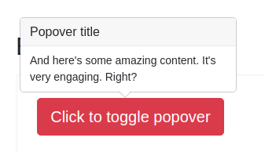
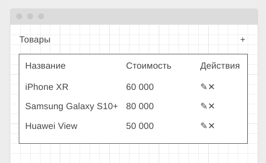
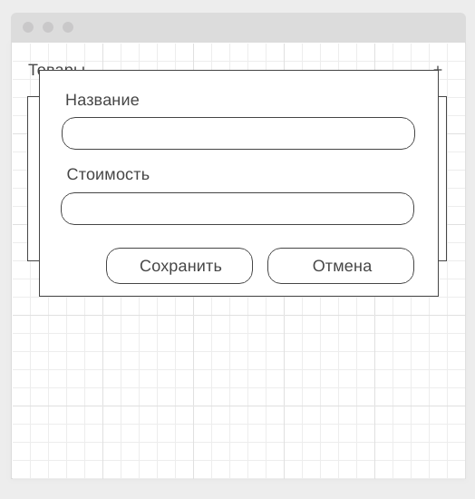
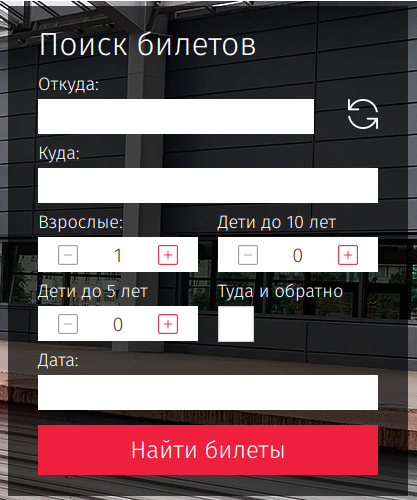
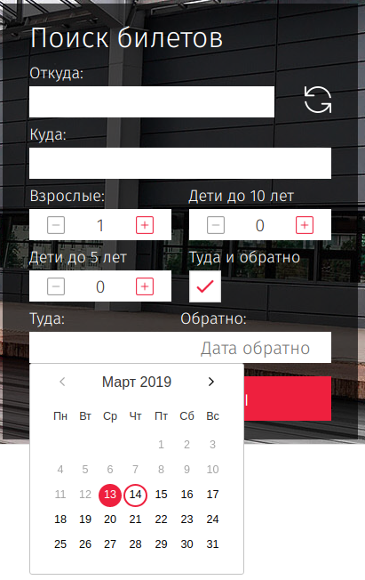

Правила сдачи задания:
1. **Важно**: в рамках этого ДЗ вы можете использовать любой пакетный менеджер
2. Всё должно собираться через Webpack (включая картинки и стили) и выкладываться на Github Pages через Appveyor.
3. В README.md должен быть размещён бейджик сборки и ссылка на Github Pages
4. В качестве результата присылайте проверяющему ссылки на ваши GitHub-проекты.

---

### Popovers

#### Легенда

Есть замечательный фреймворк Bootstrap, в котором реализовано достаточно много интересных виджетов с использованием jQuery. Но, как говорят современные и модные программисты, "jQuery не нужен", поэтому вам нужно реализовать такой же виджет на чистом JS.

#### Описание

Вот так должен выглядеть виджет в целом, для упрощения будем считать, что виджет всегда должен показываться сверху.

У popover'а обязательно должно быть название и текст. Центрироваться он обязательно должен по горизонтали относительно элемента, который вызвал popover'а.

Не забудьте написать авто-тест на взаимодействие с DOM на базе Puppeteer или JSDOM (на ваш выбор).

**Подсказка**: страница, на которой можно "подглядеть" реализацию: https://getbootstrap.com/docs/4.3/components/popovers/. Но мы пока не проходили `translate`, `translate3d`, поэтому делайте позиционирование в px.

---

### Редактор списка* (задача со звёздочкой)

Важно: эта задача не является обязательной. Её (не)выполнение не влияет на получение зачёта по ДЗ.

#### Легенда

Вы делаете CRM-систему, где в списке представлены товары, выглядеть это должно примерно так, как на скетче:

#### Описание

Вам нужно реализовать базовые операции CRUD (create, read, update, delete).

При нажатии на кнопку редактирования или добавления должно открываться всплывающее окно:

Обратите внимание, если вы нажимаете на кнопку "+" (добавить), то окно пустое, если вы нажимаете "✎" (редактировать), то поля заполнены.

Только после нажатия на кнопке "Сохранить", данные в таблице должны обновляться.

Обеспечьте валидацию данных: удостоверьтесь, что в полях название и стоимость есть текст, причём в поле стоимость допустимы только числа больше 0 (в памяти стоимость должна храниться в виде числа, а не в виде строки). Если ошибки присутствуют, отображайте их под полями ввода в виде текста (как было сделано в лекции).

Проверьте, что после редактирования, если нажать на кнопку добавить, то форма находится "в правильном" состоянии (нет сообщений об ошибках, т.к. пользователь ещё не взаимодействовал с формой).

При нажатии на кнопке "✕", строка должна удаляться (желательно с подтверждением в виде всплывающего окна (не alert/prompt/confirm) - но это не обязательно).

Все данные храните в памяти (в виде JS-объектов). DOM-дерево должно перестраиваться исходя из содержимого в памяти.

Не забудьте написать авто-тесты, разделив логику и взаимодействие с DOM. Для тестирования взаимодействия с DOM пользуйтесь Puppeteer.

---

### Trip Calendar* (задача со звёздочкой)

Важно: эта задача не является обязательной. Её (не)выполнение не влияет на получение зачёта по ДЗ.

#### Легенда

Вы делаете сервис для путешествий и вам необходимо реализовать виджет выбора дат: туда и (если установлена галочка туда-обратно) обратно.

Аналог вы можете посмотреть на сайте РЖД и любых авиакомпаний:

#### Описание

Вам нужно реализовать только переключатель туда-обратно и виджеты ввода дат/выбора их из календаря, в соответствии со следующими условиями:

1. Дата "туда" должна быть не раньше, чем сегодняшняя дата (по времени браузера)
1. Сегодняшняя дата должна быть выделена
1. Даты до сегодняшней должны быть не активны
1. Должно быть реализовано переключение месяца (без анимации, просто пересчёт дат)
1. Дата "обратно" не может быть ранее даты "туда"

Для расчёта дат воспользуйтесь библиотекой `moment js` (обязательное условие). Установите и подключите её через npm/yarn.

Не забудьте написать авто-тесты, разделив логику и взаимодействие с DOM. Для тестирования взаимодействия с DOM пользуйтесь JSDOM или Puppeteer.
