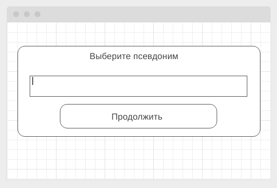
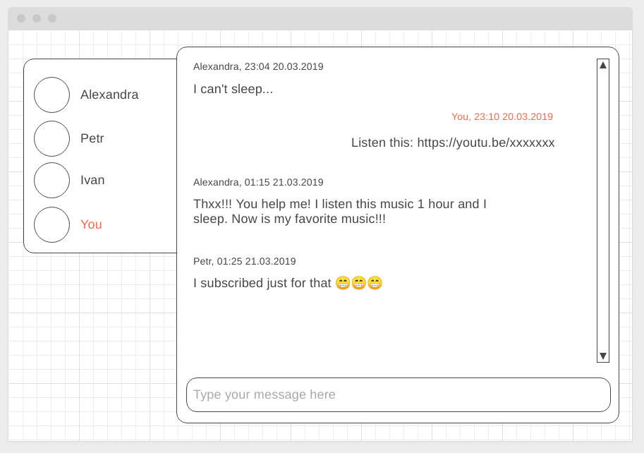
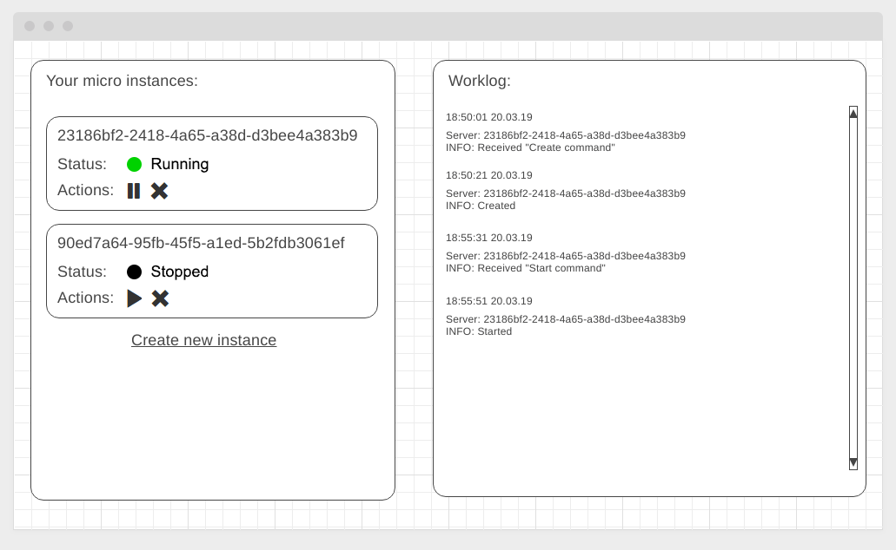
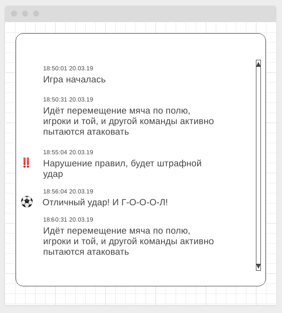

Правила сдачи задания:

1. **Важно**: в рамках этого ДЗ можно использовать любой менеджер пакетов
2. Всё должно собираться через Webpack (включая картинки и стили) и выкладываться на Github Pages через Appveyor
3. В README.md должен быть размещён бейджик сборки и ссылка на Github Pages
4. В качестве результата присылайте проверяющему ссылки на ваши GitHub-проекты
5. Авто-тесты писать не требуется
6. Серверная часть должна быть выложена на Heroku

---

## Чат

### Легенда

В рамках реализации корпоративного портала вам поручили организовать чат, и, конечно же, вы решили для этого использовать веб-сокеты.

### Описание

Вам необходимо реализовать и серверную, и клиентскую часть. Серверную часть мы предлагаем вам реализовать на базе пакета ws, который был продемонстрирован на лекции.

При загрузке страницы появляется всплывающее окно, в котором запрашивается никнейм, под которым вы будете зарегистрированы в чате:



Если такой никнейм свободен, то открывается окно чата, в противном же случае вы должны сообщить пользователю о том, что никнейм занят и ему необходимо выбрать другой (продумайте, как вы реализуете это).

Общее окно чата:



Обратите внимание: сообщения всех участников чата (кроме ваших) выравниваются по левому краю, а ваши - по правому.

Важно: `You` - это не никнейм, это указатель на то, что это Вы.

Важная детально: при отключении пользователя он должен удаляться из списка пользователей в левой части.

---

## Cloud Dashboard (задача со звёздочкой)

Важно: эта задача не является обязательной

### Легенда

В рамках реализации интерфейса для системы управления облачными серверами необходимо организовать для оператора рабочее место, позволяющиее создавать, запускать, останавливать и удалять облачные сервера.

### Описание

Общий вид рабочего места:



#### Серверная часть

Вам необходимо самостоятельно провести анализ и выбрать технологию для реализации серверной части: REST, SSE, WS, либо их комбинации. Внимательно взвесьте плюсы и минусы каждой технологии при выборе! Поскольку выбор неправильной технологии может обернуться сложностями в реализации и потерями времени.

Информация о конкретном инстансе должна быть представлена в следующем виде:
```json
{
  "id": "<uuid>",
  "state": "running | stopped"
}
```
Где `<id>` - автоматически генерируется на сервере, при создании статус - `stopped`.

Должна быть возможность:
* Создания инстанса (id генерируется автоматически)
* Удаление инстанса по ID
* Изменение состояния (с `running` на `stopped` и со `stopped` на `running`)

Обратите внимание, создание, старт, остановка и удаление инстансов виртуальной машины - это ресурсоёмкая операция, поэтому на все запросы кроме получения списка инстансов, вы отдаёте "пустой" ответ (например, `{"status": "ok"}` для REST API) и устанавливаете `setTimeout` на 20 секунд для выполнения операции, например псевдо-код для REST API:

```javascript
const instances = [];

router.post('/instances', async (ctx) => {
  // Каким-то образом, должны сообщить клиенту о том, что получена команда "Create command""
  const id = <generate id>;
  <write client notification code here>

  setTimeout(() => { // <- создаём инстанс только через 20 секунд
    instances.push({
      id,
      state: 'stopped',
    });

    // Каким-то образом должны сообщить клиенту о том, что команда выполнена, сервер создан
    <write client notification code here>

  }, 20000);

  ctx.response.body = {
    status: 'ok'
  }
});
```

#### Клиентская часть

Клиентская часть должна работать следующим образом:
1. При загрузке страницы загружается список инстансов и отрисовывается в виджете управления инстансами (слева)
1. Выполняется подключение по нужному протоколу с началом отслеживания событий. Мы предлагаем вам для разделения событий использовать следующие "ключи":
* `received` - сервером получена команда
* `created` - создан новый инстанс
* `started` - инстанс запущен
* `stopped` - инстанс остановлен
* `removed` - инстанс удалён

Виджет управления инстансами (слева) работает следующим образом:
1. Status - отображает текущий статус
1. Actions - кнопки управления состояниями (зависят от текущего статуса) позволяют отправить команду на запуск, остановку или удаление инстанса
1. Create new instance - позволяет отправить команду на создание нового инстанса.

Обратите внимание, в виджете управления состояние должно быть синхронизировано с текущим состоянием на сервере. Т.е. если вы получаете информацию с сервера о том, что инстанс стартовал, то это должно быть отображено как в Worklog'е, так и в виджете управления инстансами.

**Advanced** (необязательная часть): попробуйте реализовать виджет управления инстансами и виджет Worklog в виде отдельных виджетов, не связанных друг с другом и синхронизируйте состояние через State Management.

---

## Онлайн репортаж* (задача со звёздочкой)

Важно: эта задача не является обязательной. Её (не)выполнение не влияет на получение зачёта по ДЗ.

### Легенда

Вы делаете портал спортивных трансляций, на которых пользователи могут видеть текстовую трансляцию матча. Поскольку вам нужно получать обновления с сервера, но не отправлять их обратно, достаточно использовать SSE для получения данных.

### Описание

Необходимо реализовать серверную часть и клиентскую, позволяющие по SSE получать данные с прямого репортажа о футбольном событии

#### Серверная часть

На серверной части генерируйте с произвольным интервалом несколько типов событий:
1. Комментарий об игровом действии, например: "Идёт перемещение мяча по полю, игроки и той, и другой команды активно пытаются атаковать" (тип - `action`)
1. Штрафной удар, например: "Нарушение правил, будет штрафной удар" (тип - `freekick`)
1. Гол, например: "Отличный удар! И Г-О-Л!" (тип - `goal`)

Генерируйте события в случайном порядке с различной долей вероятности:
1. Вероятность первого события - 50%
1. Вероятность второго события - 40%
1. Вероятность третьего события - 10%

Игра должна стартовать при старте сервера (генерация событий). Максимум сгенерированных событий - 50.

Обратите внимание, все события должны кэшироваться, так, чтобы игрок, подключившийся не с самого начала матча,получал всю предыдущую историю игры.

#### Клиентская часть

Клиентская часть должна выглядеть следующим образом:



Обратите внимание, для событий с типом `freekick` и `goal` сбоку устанавливаются иконки.

Реализуйте виджет в виде отдельного класса, который сам генерирует для сбея разметку и которому в качестве параметра конструктора передаётся URL для подключения.

