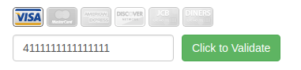

Правила сдачи задания:

1. **Важно**: в рамках этого ДЗ можно использовать любой менеджер пакетов.
1. **Важно**: всё, включая картинки и стили, должно собираться через Webpack и выкладываться на GitHub Pages через AppVeyor.
1. Всё создание можно выполнить в виде одного GitHub-репозитория.
1. В README.md должен быть размещён бейджик сборки и ссылка на GitHub Pages.
1. В качестве результата пришлите проверяющему ссылки на ваш GitHub-проект.

В качестве примера организации e2e-тестирования используйте код из каталога [`e2e`](e2e).

---

### Credit Card Validator

#### Легенда

Вам пришла задача: сделать виджет, позволяющий вводить номер карты. Для ознакомления можете почитать о PCI DSS.

Общий вид виджета должен выглядеть так:

Скриншот взят с [сайта](http://www.validcreditcardnumber.com).

Вам нужно провести исследовательскую работу и выяснить, на базе чего определяется, какой платёжной системе принадлежит определённая карта (не забудьте о «Мире»).

#### Описание

Используйте [алгоритм](https://en.wikipedia.org/wiki/Luhn_algorithm) для проверки валидности номера карты.

Изображения для карт необходимо найти самостоятельно. Помните об авторских правах и недопустимости нелегального использования. Обычно информацию об использованных изображениях размещают в файле `licenses.txt` и кладут в корень сайта. Настройте для этого соответствующим образом Webpack.

Разделите логику проверки номера карты, выяснения принадлежности определённой платёжной системе и взаимодействия с DOM.

Напишите автотесты на функции проверки номера карты и принадлежности к определённой платёжной системе.

Убедитесь, что всё работает при прогоне тестов в AppVeyor.

**Подсказка: для поиска изображений можете воспользоваться сервисом [findicons.com](https://findicons.com)**.

---

### Puppeteer

Подключите Puppeteer и проверьте взаимодействие для двух различных вариантов:
1. Ввод валидного номера карты.
1. Ввод невалидного номера карты.

Убедитесь, что всё работает при прогоне тестов в AppVeyor. Не забудьте о headless-mode.

---

### JSDOM (задача со звёздочкой)

Важно: это необязательная задача.

К предыдущей задаче подключите JSDOM и реализуйте проверку с использованием `jest.each`. То есть вам надо проверить взаимодействие с DOM.

Убедитесь, что всё работает при прогоне тестов в AppVeyor.
