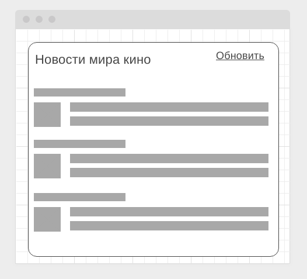
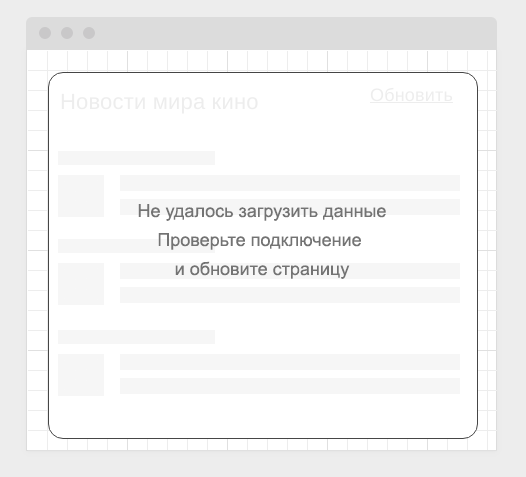
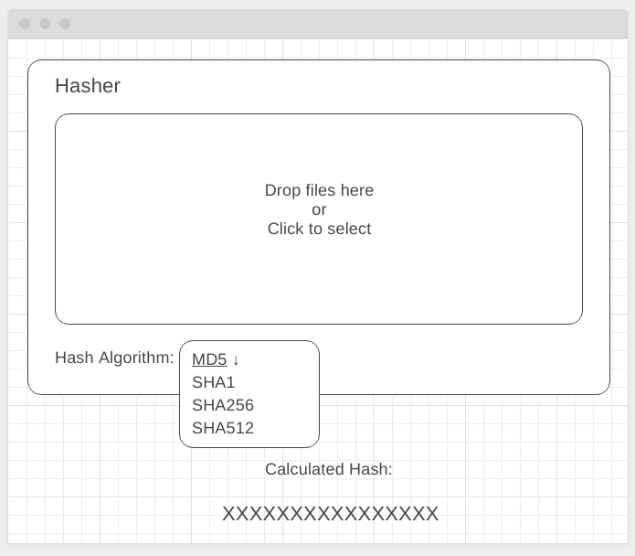
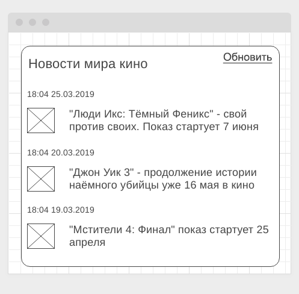

Правила сдачи задания:

1. **Важно**: в рамках этого ДЗ можно использовать любой менеджер пакетов
2. Всё должно собираться через Webpack (включая картинки и стили) и выкладываться на Github Pages через Appveyor
3. В README.md должен быть размещён бейджик сборки и ссылка на Github Pages
4. В качестве результата присылайте проверяющему ссылки на ваши GitHub-проекты
5. Авто-тесты писать не требуется
6. Серверная часть должна быть выложена на Heroku

---

### Loading Styling

#### Легенда

Сейчас модно показывать интерфейсы загрузки вроде следующего:



#### Описание

Реализуйте подобный интерфейс, закешировав статические ресурсы и показывая данный внешний вид до момента загрузки данных.

Обратите внимание, даже если у пользователя нет подключения, страница всё равно должна отображаться, но в режиме "загрузки" и после неудачной попытки соединения переходить в режим:



Для эмуляции задержки можете самостоятельно написать middleware для koa, или посмотреть на существующие вроде [koa-slow](https://github.com/bahmutov/koa-slow)

Напоминаем, что для кэширования вы можете воспользоваться плагином Workbox.

---

### Hasher* (задача со звёздочкой)

Важно: эта задача не является обязательной. Её (не)выполнение не влияет на получение зачёта по ДЗ.

#### Легенда

Периодически необходимо проверять контрольные суммы различных файлов, чтобы удостовериться, что при передаче с этими файлами не произошло ничего плохого. Конечно, для этого уже есть готовые инструменты, но всё равно пользователи пользуются какими-то онлайн-сервисами, загружая туда конфиденциальные файлы.

Поэтому ваш руководитель решил, что можно это сделать и на корпоративном портале (чтобы ничего никуда не загружалось) через браузер с помощью специальной библиотеки [crypto-js](https://github.com/brix/crypto-js/), что вам и предстоит сделать.

#### Описание

Вам необходимо скачать и установить библиотеку crypto-js, делается это стандартным способом через npm или yarn.

Внешний интерфейс виджета должен выглядеть следующим обазом:



Хэш автоматически пересчитывается при выборе другого алгоритма хеширования (выпадающее меню) или выбора другого файла.

Файлы могут загружаться как выбором (при клике на область должен открываться стандартный интерфейс выбора файла в браузере), так и DnD.

Поскольку ваш виджет в дальнейшем могут захотеть использовать в составе других интерфейсов, крайне нежелательно, чтобы загрузка файла и расчёт контрольной суммы приводили к зависанию интерфейса.  Поэтому их необходимо вынести в Web Worker. 

Функции crypto-js требуют объекты специального внутреннего формата `WordArray`. Получить из `ArrayBuffer` его и рассчитать хэш можно с помощью следующего кода:
```javascript
const wordArray = crypto.lib.WordArray.create(<array buffer here>);
const hash = crypto.MD5(wordArray).toString(crypto.enc.Hex);
```

`hash` - и есть полученная контрольная сумма, рассчитанная по алгоритму MD5. Вам, естественно, нужно сделать поддержку не только MD5, а ещё и:
* crypto-js/sha1
* crypto-js/sha256
* crypto-js/sha512

Продумайте, как вы будете проверять, что ваше приложение считает хэш правильно.

---

### Buggy Service (задача со звёздочкой)

Важно: эта задача является необязательной для реализации

#### Легенда

Вам выпала нелёгкая задача - интегрироваться с "глючным" сторонним сервисом новостей. Сервер периодически "отваливается", отвечая кодом 500. Поскольку вы уже знакомы с Service Workers, вы решили кэшировать ответы сервера, когда они всё-таки появляются и отдавать закешированные, если сервер отвечает ошибкой.

#### Описание

Вам необходимо реализовать сервер, эмулирующий эту ситуацию (достаточно выставлять правильный код в koa, как мы это делали в лекции по HTTP, либо можете дополнительно ознакомиться с [обработкой ошибок в koa](https://github.com/koajs/koa/wiki/Error-Handling)).

Общий вид интерфейса:



Можете использовать сервер из предыдущего задания, добавив туда генерацию ошибки случайным образом.
